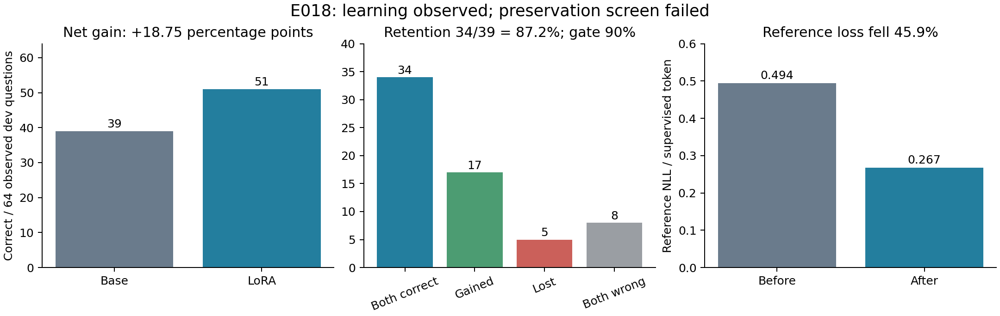

# Thursday decision brief — September 17, 2026

Execution ended at the prespecified E018 retention gate. The four-cell arithmetic
experiment was not run; there is no interaction or familiarity result.

| E018 measure | Original base | Final LoRA |
|---|---:|---:|
| Correct, observed development | 39/64 | 51/64 |
| Parsed final answer | 49/64 | 64/64 |
| Native EOS | 47/64 | 64/64 |
| Actual length cap | 1/64 | 0/64 |
| Reference NLL, 253 anchors | 0.493771 | 0.267110 |

There are 17 gained, 5 lost, 34 both-correct and 8 both-wrong
questions. Net change is 18.75 percentage points
(paired-question bootstrap 95% interval 4.69
to 32.81). Retention is
34/39=87.18%, below 90%; at least 36 retained
successes were required. This is an operational failed screen, not a statistical
proof of population-level harm. Its descriptive retention interval spans
75.76–97.22%.

Reference NLL fell 45.90%. Base parameter bytes were
unchanged; the 18,464,768-parameter adapter changed and was saved/reloaded exactly
in CPU tests and independently preserved after GPU training. All 160 raw streams
pass local audits, and all 64 zero-adapter base streams match E017. All five lost
outputs have valid EOS/parse and substantive quantity/arithmetic errors. Among
17 gains, 11 had missing/unresolved base answer markers; do not label the full
net gain a reasoning improvement. The fixed 32 training-quality audit also found
one erroneous speed/time reference, disclosed and retained without backfill.

## Data readiness

All three prespecified candidate interfaces support 256 train, 16 construction
calibration and 96 discovery problems, plus independent 96 probes and 32 prefix
pairs. Primary subtraction-to-multiplication main tokens are 265,744 Surface
versus 265,664 Paths (residual 0.030%);
prep tokens differ 2.75%, approximately
matched. Targets range 10–100,
including 115/256 above 40. No common-length question
filter or reserved-question read occurred. Fine structure total variation is
8.98%; A/B identity-operation
paths occur on 59/57
questions. These residuals remain interpretation limits. Model nonsaturation and
the prep manipulation have not been tested.

## Decision for the next revision

Keep the failed screen and avoid a same-run retry or post-hoc threshold change.
If the original preservation requirement remains the priority, propose one new
bounded calibration changing only LoRA peak LR from 1e-4 to 5e-5, retaining the
same fixed corpus/dose and recording the known label defect. Do not combine an
LR change with data corrections, extra epochs or another model. This is a
proposal, not an executed experiment or a promise the gate will pass.

Alternatively, the owner may explicitly revise the next protocol toward a
task-matched arithmetic calibration before the two prep models. That would be
a changed decision rule and must not relabel E018 as passed. Freeze treatment
of identity paths and fine-structure imbalance before any discovery outcomes.
The one-seed 2×2, if later run, remains an exploratory decision experiment.

## Preservation and cost

Training took 68.0s; the guarded process charged
371s. The historical 21-receipt ledger stays
unchanged;22 receipts across phases now total 7,372 process seconds. Whole-rental
proxy is 24.0minutes/about CNY 3.19 at
CNY 7.98/hour, including setup/export; it is not an invoice. Provider shutdown
is verified. All 18 output/checkpoint files are independently copied, including
the complete 73.92MB adapter package. E015's incomplete independent full-weight
backup remains a separate preservation obligation; its instance was not deleted.

Not generated: PREP_MANIPULATION_CHECK.csv, FOUR_CELL_RESULTS.csv and arithmetic
PER_PROBLEM_RESULTS.jsonl, because their runs did not occur. Actual E018 pairs:
[per_problem.jsonl](e 018_audit_r 1/per_problem.jsonl). Supporting records:
[run manifest](RUN_MANIFEST.json), [data audit](DATA_AUDIT.json),
[cost](COST_REPORT.json), [lost-case review](E018_LOST_CASE_REVIEW.json).

