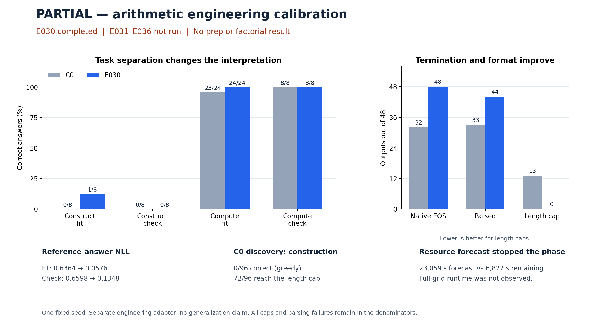

# Thursday brief — PARTIAL arithmetic v2

**E030 completed; E031–E036 were not run.** The registered conservative runtime forecast stopped the phase. No prep manipulation or factorial effect was measured. E018 remains failed and was not rerun.

| Calibration task | C0 correct | E030 correct |
|---|---:|---:|
| Construct / fit | 0/8 | 1/8 |
| Construct / check | 0/8 | 0/8 |
| Compute / fit | 23/24 | 24/24 |
| Compute / check | 8/8 | 8/8 |

Overall accuracy was 31/48 → 33/48: two fit gains, no losses, and no check-set gains. These mixed-task totals are **not construction accuracy**. Construction improved only from 0/8 to 1/8 on fit; check construction stayed 0/8.

Native EOS increased 32/48 → 48/48; parsed outputs 33/48 → 44/48; caps 13/48 → 0/48. Fit reference NLL fell 0.6364 → 0.0576; check NLL 0.6598 → 0.1348. This supports learning of the reference-answer distribution and termination/format, not successful free construction or generalization. The calibration adapter is independent of the scientific parents.

**Construction failures:** 8 target-only errors, 1 number-use-only error, 2 combined errors, 4 unparsed outputs. The two fixed lexicographic examples use the required numbers once but evaluate to 210 instead of 47, and 27 instead of 42.

**C0 only:** sampled pass@1 (32 questions/group, n=4) was atomic 44.53%, target 58.59%, control 52.34%. Discovery greedy was 0/96, with 72 caps, 20 boundary stops and 4 EOS stops. There is no trained-parent comparison.

**Resource stop:** the forecast was 23,059s versus 6,827s remaining. It extrapolates the slowest measured base view (2.902927s/output) to all remaining generations and adds the registered safety margin. This is not evidence that the grid actually needs 6.4 hours. There were 592 actual generations: 576 unique completed results plus 16 fault repeats; 4 interrupted outputs were not recoverable. Charged process time: 1,543s. Provider shutdown: 2026-09-16T20:54:07+00:00; powered-on proxy 43m07s, CNY5.7345, not an invoice.

**Next proposal — resource plan only:** reuse completed evidence; revise the finite resource allowance and stage-specific throughput forecast. Run both fixed prep recipes from the original C0 initialization and measure their prescribed probe throughput, then execute the complete four-cell comparison under a common recipe. Keep resource admission independent of accuracy/significance, and retain export/shutdown reserves. No automatic startup, no E018/E030 rerun, and no inheritance of either calibration adapter.

