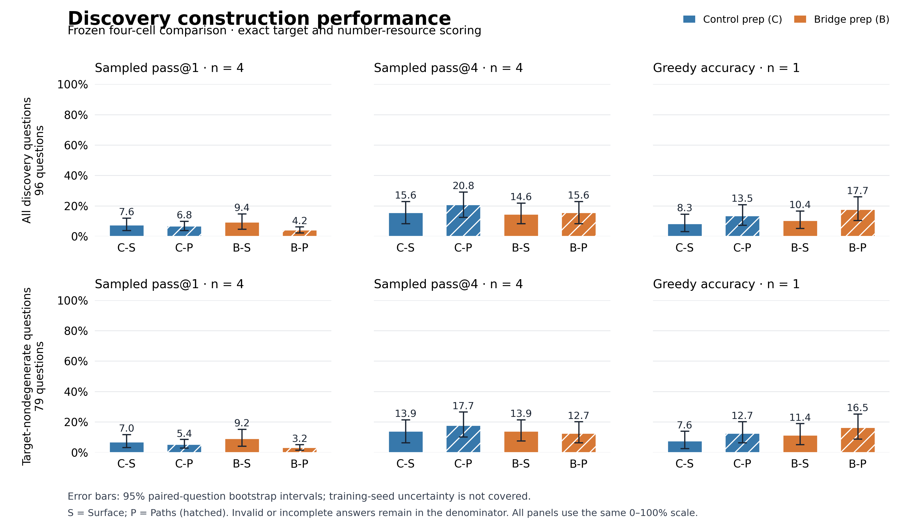

# E031–E036: complete arithmetic discovery factorial

2026-09-16. **All six registered training runs and all 4,192 new generations completed. The provider is off; the queue is closed and paused for the owner’s next decision.**

The central result is a complete but inconclusive readiness interaction. Both prep parents nearly saturate the computation probes, so the intended target-specific readiness difference is not demonstrated. Paths improves the observed greedy score in both prep states, but sampled pass@1 moves in the opposite direction; every full-grid interaction interval includes zero. The four cells are above a universal zero floor, yet free construction remains weak. This does not establish equivalence, a general benefit/harm of Paths, or a causal routing mechanism.

## Frozen execution and coverage

Execution source `2379c90351bdb4ffa247f5b4c6c0fe6301e718d7`; offline verification/analysis source `e70d3a4`. Original Qwen2.5-1.5B Base revision `8faed761d45a263340a0528343f099c05c9a4323`, LoRA rank16/alpha32, seed17, effective batch16, peak LR5e-5, original data, schedules, scoring, n=4 sampling and max512 remain unchanged. Parents branch from the original C0 adapter, not E030; each child resets optimizer and scheduler. No reserved confirmation/test set was read.

| Experiment | State | Parent | Updates | Supervised response tokens | Processed tokens |
|---|---|---|---:|---:|---:|
| E031 | C | C0 | 32 | 16,278 | 30,608 |
| E032 | B | C0 | 32 | 15,842 | 30,172 |
| E033 | C-S | C | 256 | 265,744 | 470,768 |
| E034 | C-P | C | 256 | 265,664 | 470,688 |
| E035 | B-S | B | 256 | 265,744 | 470,768 |
| E036 | B-P | B | 256 | 265,664 | 470,688 |

Total: **1,088 updates, 1,094,936 supervised response tokens, 1,943,692 processed nonpadding tokens**. Six endpoint recovery states include AdamW and all four RNG domains;20 scientific adapter checkpoints are independently retained. The single worker finished without restart or discarded updates.

New coverage is26/26 evaluation events,524 batches,4,192 unique request IDs. Including the four reused historical views, offline scoring verifies30/30 views and4,768 unique completed outputs. Actual cumulative generation use is4,784/4,864: the original16 fault attempts remain charged, including4 irrecoverable records. There are no new fault duplicates;80 requests remain unused, not authorized as another experiment.

## Shared discovery set:96 questions

S = Surface; P = Paths; C = control prep; B = target/bridge prep. Each sampled cell has96 questions ×4 outputs; pass@1 averages all384 outputs, while pass@4 counts questions with at least one success. Greedy is a separate96-output evaluation. Every invalid or truncated answer remains in its original denominator.

| State | Sampled correct /384 | pass@1 | Solved /96 at n=4 | pass@4 | Greedy correct /96 |
|---|---:|---:|---:|---:|---:|
| C-S | 29 | 7.55% | 15 | 15.62% | 8 (8.33%) |
| C-P | 26 | 6.77% | 20 | 20.83% | 13 (13.54%) |
| B-S | 36 | 9.38% | 14 | 14.58% | 10 (10.42%) |
| B-P | 16 | 4.17% | 15 | 15.62% | 17 (17.71%) |

Define ΔC = CP−CS, ΔB = BP−BS, I = ΔB−ΔC. All following differences/intervals are **percentage points**, not relative percent changes.

| Measure | ΔC | ΔB | I | 95% question-paired CI for I | 95% template-cluster CI for I |
|---|---:|---:|---:|---|---|
| Sampled pass@1 | -0.78 | -5.21 | -4.43 | [-9.64, 0.52] | [-10.89, 0.76] |
| Sampled pass@4 | +5.21 | +1.04 | -4.17 | [-16.67, 8.33] | [-21.11, 9.38] |
| Independent greedy | +5.21 | +7.29 | +2.08 | [-5.21, 9.38] | [-4.08, 7.08] |

B-P’s sampled pass@1 is20/384 lower than B-S (−5.21pp; paired-question95% CI[−10.42,−0.52], template CI[−11.24,−0.30]). This is an observed simple contrast in a single-seed discovery experiment. It does not establish the interaction, and the greedy ordering reverses. Report all measures; do not choose a favorable decoding mode after inspection.

For the79 target-nondegenerate questions, the original label remains frozen:

| Measure | C-S | C-P | B-S | B-P | I (pp) | 95% question CI for I |
|---|---:|---:|---:|---:|---:|---|
| Sampled pass@1 | 6.96% | 5.38% | 9.18% | 3.16% | -4.43 | [-10.13, 0.95] |
| Sampled pass@4 | 13.92% | 17.72% | 13.92% | 12.66% | -5.06 | [-18.99, 8.86] |
| Independent greedy | 7.59% | 12.66% | 11.39% | 16.46% | +0.00 | [-7.59, 7.59] |

The positive full-set greedy interaction becomes exactly0 on this nondegenerate subset. The17 degenerate questions alone have a+11.76pp greedy interaction; this small descriptive subgroup does not establish a general effect. All paired bootstrap intervals use the frozen10,000-replicate procedure and seed; clustering uses reference-B structure (17 full-set clusters). They cover empirical question/template variation, not training/prep/assignment-seed uncertainty. Fine-structure TV8.98% and prep-token residual≈2.75% remain; a difference-in-differences does not cancel their interactions automatically.

## Parent manipulation and post-training sentinel

| Parent | Atomic correct /128 | Target correct /128 | Control correct /128 | pass@4 atomic / target / control |
|---|---:|---:|---:|---|
| C0 | 57 | 75 | 67 | 75.00% / 96.88% / 100.00% |
| C | 128 | 128 | 125 | 100.00% / 100.00% / 100.00% |
| B | 128 | 128 | 126 | 100.00% / 100.00% / 100.00% |

C and B both reach128/128 on atomic and target computations. Control is125/128 versus126/128. D=[Btarget−Ctarget]−[Bcontrol−Ccontrol]=−0.78125pp, stratified paired-question95% CI[−2.34375,0]. Target’s observed zero-width change CI is a ceiling in these samples, not proof of exact underlying equality. Each category is32 questions, not128 independent questions. Both prep conditions improve formatting/computation relative to C0; selective target preparation is unestablished.

Parent construction remains C=1/384 and B=0/384 sampled successes; both greedy0/96. Their compute proficiency therefore cannot stand in for free target construction.

Endpoint sentinel has16 questions/category ×2 samples. Every child gets atomic32/32 and target32/32. Control is30/32 for C-S/C-P/B-S and31/32 for B-P; both matched parent subsets were31/32. These are supplementary matched48-question/first-two-sample comparisons, separate from the full parent probe table. The results do not show that main training erased a distinct target advantage: that advantage was not established at the parent stage.

On the same fixed24-question midpoint subset, parent→step128→step256 greedy successes are C-S0→5→5, C-P0→1→4, B-S0→4→5, B-P0→3→5. This is descriptive trajectory evidence; endpoint256 remains the registered comparison, with no best-checkpoint selection.

## Training16 and reference fitting

| State | All16 greedy | Nondegenerate8 greedy | A-reference NLL | B-reference NLL |
|---|---:|---:|---:|---:|
| C-S | 8/16 | 3/8 | 0.113195 | 0.080301 |
| C-P | 3/16 | 0/8 | 0.074492 | 0.063925 |
| B-S | 10/16 | 4/8 | 0.115312 | 0.090414 |
| B-P | 4/16 | 1/8 | 0.074737 | 0.062923 |

All64 training diagnostics parse and end with native EOS. The sample has four questions per anchor-family × target-degeneracy stratum:8/16 are degenerate versus54/256 in the training population. These unweighted16-question results are neither whole-training accuracy nor a precise train–discovery generalization gap. Nondegenerate Paths is particularly weak here, but n=8 is small.

Paths has lower teacher-forced reference NLL in both families despite lower free-generation success on this fixed training diagnostic. This supports a reference-fit/free-construction gap in the observed sample, not proof that training was ignored or that any specific latent mechanism caused failure. A/B names reference program families, not prep states. Each Surface NLL aggregate mixes8 anchor/8 non-anchor questions; Paths sees both families but not necessarily the same reference rendering. NLL is response-token weighted and cannot isolate literal memorization or unseen-path competence. The8 reference forward passes total5.0582s, already within process/rental accounting; no extra autoregressive generations.

## Error decomposition from saved outputs

The following sampled counts retain all384 outputs/cell. “Target correct, resource wrong” still fails the task. Undefined exact values are separate from target errors rather than silently corrected.

| State | Both satisfied | Resources correct, target wrong | Target correct, resources wrong | Both wrong | Unparseable | Undefined value | Local arithmetic consistent / inconsistent / NA |
|---|---:|---:|---:|---:|---:|---:|---|
| C-S | 29 | 179 | 1 | 161 | 14 | 0 | 253 / 111 / 20 |
| C-P | 26 | 245 | 3 | 98 | 10 | 2 | 277 / 92 / 15 |
| B-S | 36 | 205 | 2 | 130 | 11 | 0 | 276 / 91 / 17 |
| B-P | 16 | 260 | 2 | 83 | 23 | 0 | 287 / 80 / 17 |

Paths produces more samples with the correct input multiset but the wrong target (245 and260 versus179 and205). Locally consistent intermediate arithmetic is common, yet is insufficient for target satisfaction or exact resource use. This points to target-conditioned construction as a useful next diagnostic; it does not prove a pure search/routing deficit. Per-output trace↔final-expression and trace↔target fields retain unknown as NA. Original strict answer scores remain unchanged.

Construction formatting largely works after main training: sampled parse fractions are370/384,374/384,373/384,361/384; only C-S has2 length caps, and all384 greedy endpoint outputs terminate with EOS. Thus the remaining failure rate is not explained primarily by the historical stopping/format issue. We accept every legal correct program, including programs outside references A/B.

## Timing, storage, accounting and verification

One worker ran21:44:51–23:00:32UTC,4,540.9166 wall seconds, chargedceil=4,541. Training segments total2,430.834s, including2,262.540s of logged update time and168.294s of combined initialization/recovery/hash overhead. New generation calls total1,798.396s including prefill,243,077 retained tokens and325,336 padded generated tokens. Separately instrumented prefill/decode-only times were not measured and remain NA. The prior23,059s whole-queue forecast was conservative; it was not an observed runtime or a score gate.

Provider shutdown was verified by23:02:11UTC, and the temporary timer was cancelled. The conservative power-on proxy21:24:00–23:02:11 gives5,891s (1h38m11s), **CNY13.0584 at verifiedCNY7.98/h**, including setup/idle/export; this is not an invoice. Limits8h/CNY65 were respected. The earlier v2 window’s≈CNY5.7345 proxy remains separate; their combined proxy is≈CNY18.7929, not lifetime spend. No recharge, new instance or paid storage was used.

Final data-disk free space:3,097,796,608 bytes (2.88505GiB). No historical data/weights were removed. Only this run’s obsolete rolling recovery states were pruned after replacement verification. All3,515 inventoried files/2,900,439,829 bytes were independently copied and SHA256-verified, including20 adapters and6 optimizer/RNG states. The3,443 compact public files match their raw counterparts byte for byte; full binaries remain privately backed up. The original exported active rental ledger is preserved, with provider closeout in a separate sidecar. E015’s unique full weights remain protected on the stopped instance; its independent full-weight recovery obligation is still open.

All previous24 receipts/8,915 process seconds and E030 registry history are unchanged. One new process receipt brings the total to25/13,456; the six logical training runs are not six extra receipts. Historical E017 ledger SHA remains `48541b40ec441c1c5d5870d7c198c00a5e567ef7bc3804e03ccc1d61a63fda8e`.

Before GPU execution44 focused CPU tests plus2 GNU-timeout tests passed on Linux. The final offline verifier/analyzer suite has19 passing tests. Independent audits check saved tensors/ancestry/doses/LR/AdamW/RNG/request chains and reconstruct tokenizer/stopping/math scores for all outputs. They do not recompute training gradients or replay CUDA generation. Plot files were visually inspected.

A separate [training-contract audit](../experiments/thursday_probe_v2/TRAINING_CONTRACT_AUDIT_resume_r1.json) re-encodes all512 Surface/512 Paths and both256-row prep datasets with the pinned tokenizer. All six execution-time encoded-row hashes and per-update token doses match. Prompts and padding are masked, response/EOS tokens are supervised, and loss uses the full effective-batch target-token denominator. All64 training-diagnostic prompt streams match their training prefixes; the longest main sequence is126 tokens, with no truncation. Three focused model-free CPU tests pass. These checks exclude specific serialization/masking/dose discrepancies, not every possible implementation error or historical-gradient fault.

## Proposed next decision — no new job started

Prioritize a bounded **goal-conditioned one-hole program-completion experiment**, paired with matched expression-computation controls. On fresh group-disjoint development problems, give the same numbers and partial program while counterfactually changing the target to require a different valid completion. Freeze solvability, unique/multiple-solution labels, sampling and exact resource/target scoring before use. This reduces free search and directly asks whether the model uses the target constraint; it is more discriminating than further computation probes that already saturate.

The owner should approve the finite diagnosis before allocating another training grid. If reduced-search completion is reliable while free construction fails, investigate construction/search and task-matched partial-construction prep; if completion also ignores the target, first address target-conditioned data/learning. Neither outcome alone identifies an internal mechanism. Any revised prep and comparison needs a new protocol and matched dose/format controls. Repeating the full parent-plus-child four-grid across seeds is required before a general interaction claim; do not merely resample this seed or select the favorable greedy metric. No automatic extension, new calibration, LR sweep, n8, RL, or model change is queued.

## Reproduction and records

- [Registered resume amendment](../experiments/thursday_probe_v2/RESUME_AMENDMENT_r1.md)
- [Machine-readable analysis and source/input hashes](thursday_resume_analysis_r1/manifest.json)
- [Full paired contrasts](thursday_resume_analysis_r1/core_2x2.json)
- [Independent checkpoint/request audit](../experiments/thursday_probe_v2/INDEPENDENT_VERIFICATION_resume_r1.json)
- [Export verification](../experiments/thursday_probe_v2/EXPORT_VERIFICATION_resume_r1.json)
- [Actual cost closeout](../experiments/thursday_probe_v2/COST_REPORT_resume_r1.json)
- [One-page discussion draft](../experiments/thursday_probe_v2/THURSDAY_BRIEF_resume_r1.md)
- [Compact raw predictions and journals](../runs/thursday_arithmetic_resume_r1/)

Offline reproduction uses `python -m experiments.thursday_probe_v2.resume_analyze --tokenizer-dir PINNED_TOKENIZER --run-dir runs/thursday_arithmetic_resume_r1 --historical-dir runs/thursday_arithmetic_v2_r2 --output NEW_ANALYSIS_DIRECTORY`. Full tensor/recovery verification additionally requires the private binary backup and C0 checkpoint. No model forward pass is required for either analysis.
