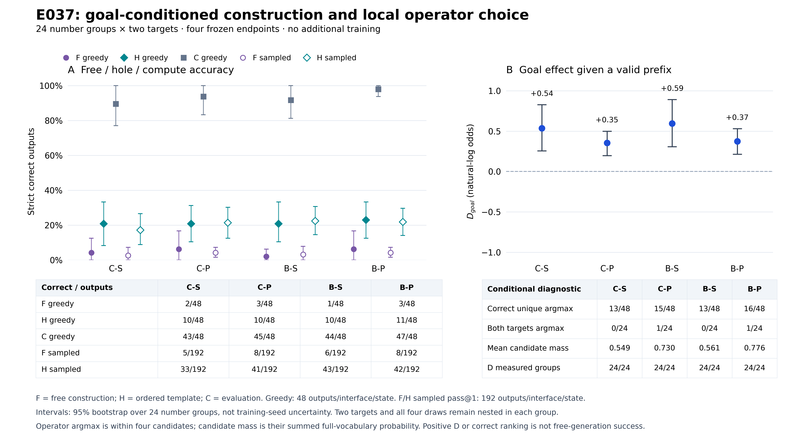

# E037 — goals affect local preferences, but reliable goal switching remains rare

All planned frozen-endpoint measurements completed: **2112 unique generations,
192 operator contexts and768 candidate scores, zero training updates**. The
provider was confirmed off at2026-09-17 02:47:37UTC and the temporary timer was
cleared. Independent export and token/stop/math/ordered-AST replay passed.

The main finding is a distinction between **directional target sensitivity** and
**correct target-conditioned decisions**. A supplied skeleton helps, but neither
free completion nor forced-prefix candidate ranking reliably solves both targets
of the same number group. This does not support a pure search-deficit explanation
or the claim that targets are completely ignored.

## Measurements

The new pool contains24 number groups, each with two targets and one common
ordered skeleton:21 skeleton families,12 root holes and12 internal holes. Every
operator is the unique correct answer12 times and6 times at each target position.
Numbers1–40 and integer targets10–100 preserve the original domain. This is new
numerical-instance development data, not structural OOD or a sealed test.

F = free construction; H = strict ordered-skeleton completion; C = evaluating the
filled expression. F accepts any legal solution. H must retain the supplied tree.
All models are the frozen final E033–E036 adapters on the same Qwen2.5-1.5B Base.

| Endpoint | F greedy | H greedy | C greedy | F sampled pass@1 | H sampled pass@1 |
|---|---:|---:|---:|---:|---:|
| C-S / E033 |2/48|10/48|43/48|5/192|33/192|
| C-P / E034 |3/48|10/48|45/48|8/192|41/192|
| B-S / E035 |1/48|10/48|44/48|6/192|43/192|
| B-P / E036 |3/48|11/48|47/48|8/192|42/192|

Sampled decoding keeps n=4, temperature0.7, top_p0.95, top_k0, max512 tokens and
seed2026091703. Greedy is also retained. New and historical pools differ, so
these numbers are not a before/after training improvement over E031–E036.

| Endpoint | H both targets, greedy | H both targets, sampled | Sampled rescue Fwrong/Hright | Sampled loss Fright/Hwrong | H−F percentage points [group95% CI] |
|---|---:|---:|---:|---:|---:|
| C-S |2/24|2/96|33/192|5/192|+14.58 [5.21,24.48]|
| C-P |0/24|2/96|41/192|8/192|+17.19 [6.77,27.60]|
| B-S |1/24|2/96|40/192|3/192|+19.27 [10.94,28.12]|
| B-P |0/24|1/96|39/192|5/192|+17.71 [9.38,26.04]|

The sampled96 pair outcomes are nested in24 groups. They are not96 independent
problems. Both group and skeleton-cluster intervals for the sampled H−F contrast
are above zero; two greedy group intervals touch zero. Supplying a skeleton also
changes difficulty and interface, so the gain does not isolate internal search.
Pass@4 and full uncertainty tables remain in FREE_HOLE_COMPUTE_RESULTS.json.

## A positive goal effect is not a correct choice

The fixed valid answer prefix ends before the missing operator. The four full
candidate encodings share a verified token prefix; all actual suffixes are single
tokens after boundary retokenization. No future result, target-as-answer, or EOS
is included in the scored span. Each context therefore took one actual forward.

| Endpoint | D_goal mean [group95% CI], nats | Correct unique argmax | Both targets unique argmax | Mean total candidate mass | Mean correct raw probability | Mean correct within-set probability |
|---|---:|---:|---:|---:|---:|---:|
| C-S |0.536 [0.255,0.828]|13/48|0/24|0.549|0.154|0.277|
| C-P |0.354 [0.198,0.500]|15/48|1/24|0.730|0.195|0.276|
| B-S |0.594 [0.307,0.891]|13/48|0/24|0.561|0.168|0.287|
| B-P |0.375 [0.213,0.531]|16/48|1/24|0.776|0.208|0.280|

D_goal is the paired change in the log-odds of the two correct operators. Its
four means and both group/family intervals are positive. Thus changing the target
has a directionally appropriate effect under this prefix. However, local rankings
remain wrong for most targets and almost never correct for both targets. A small
correct-direction shift often does not overcome the pre-existing operator preference.
Candidate-set probabilities must not be described as full-vocabulary output
probabilities. The model can place substantial mass outside these four tokens.

## Interface and expression-faithfulness errors

H has substantial interface failures. Across four states,51/192 greedy answers
are not parsed;49 of these retain `?`. In sampled H,251/768 are not parsed,
including208 retaining `?`. The302 non-parsed outputs include3 incomplete stops; the mutually exclusive
error table therefore reports299 parse failures plus3 incomplete stops.
Strict scores are unchanged. Some valid expressions
also alter the supplied ordered skeleton. The supplementary interface audit
separately enumerates retained holes, malformed answers and tree changes.

C is high but not perfect:13/192 matched-compute answers are wrong. The
supplementary trace inspection finds that12 of these have locally consistent
arithmetic while changing the requested expression or its interpretation; one
has an explicit inconsistent local equation. Therefore high C does not establish
perfect expression faithfulness or eliminate every computation-side explanation.

The forced-prefix result prevents an overly optimistic interface-only reading:
fixing a valid prefix still yields only0–1/24 groups with both correct argmaxes.
Conversely, positive D_goal prevents the claim that the models have no target
sensitivity. Both weak choice and interface adherence deserve attention.

## Training-support audit and transparent correction

The actual main-data audit is unambiguous: Surface and Paths each have256 number
multisets, each observed with exactly one target. Surface has one ordered program
per multiset/target, whereas Paths has two. This is a fact about released SFT data,
not proof that a model ignores targets or a statement about base pretraining.

**Correction:** the frozen preparation audit mistakenly included32 E030 calibration
rows when labeling the endpoints' training-support union. E030 is a sibling of
E031/E032 from the original C0, not their ancestor. Actual endpoint support uses
prep256 + main512 =768 source rows /512 distinct number multisets, not800/544.
The frozen file remains preserved as executed; TRAIN_SUPPORT_LINEAGE_CORRECTION
and the canonical report TRAIN_TARGET_SUPPORT_AUDIT.json correct its interpretation.
The original per-main-data conclusion remains valid. Leakage checks still correctly
exclude calibration data, and no selected question, model call or score changes.

## Recommended next decision — proposed only

Prioritize **target contrast and partial-construction supervision with an explicit
shared output format**, rather than more saturated arithmetic preparation or old
C/B factorial seeds. Finish reading the interface-error audit before freezing a
new intervention. Do not treat the observed H gain as a solved goal-switching task.

A concrete next comparison, requiring the owner's next instruction:

1. Use E031 as the common prespecified starting state, not the best diagnostic
   endpoint. Construct256 new number/skeleton groups, disjoint from this diagnostic
   and protected allocations; each has two uniquely valid targets.
2. G-single sees one target with two renderings of its valid full expression.
   G-paired sees both targets, one valid expression each. Keep the same256 groups,
  512 rows, common H output format, balanced operator roles/renderings and reported
   token-length residuals. Both arms learn the interface with the same record clock.
3. Keep the proposed128 updates (four epochs, batch16), LR5e-5, LoRA capacity and
   independent fresh optimizers. Freeze tokens, schedules, new evaluation pools
   and a separately costed finite queue before any training.
4. Require both new paired-target performance and transfer to new unskeletoned F
   construction, retaining greedy and the fixed n=4 sampling. Interface adherence
   alone is not evidence of stronger reasoning. Use fresh numerical groups for
   confirmation, not outcome-selected subsets of these24.

This compares two data recipes jointly changing target count, program support and
exact repetition; it cannot by itself identify a pure binding or routing mechanism.
A later independent training seed or third control is conditional on a reproducible
transfer result, not automatically launched. No new training was started here.

## Evidence limits and closeout

All95% intervals are prespecified exploratory bootstrap intervals over24 groups
or21 skeleton families, not training-seed uncertainty. They are not a corrected
confirmatory multiple-comparison analysis. Empirical bootstrap intervals can
collapse to[0,0] when no events are observed; that does not establish a population
rate of zero. The selected finite diagnostic pool does not characterize all tasks,
and no novelty or internal-mechanism claim is established.

The previous four-cell study remains complete with inconclusive interaction and
an unestablished selective preparation manipulation. This phase does not reopen
that narrative, increase old sampling, or turn a diagnostic into a paper contribution.

Execution source: `0a6770f5fceb929aff6d425b9ce8af293c12e71b`.
Release manifest: `5388eb4d0461bab305a9736d8d92e7c3c00a95097f613110d65c52108f7bb040`.
New reserve2112/2304; historical4784/4864 unchanged. One new process receipt1149s;
combined26 receipts/14605 charged process seconds. Actual operator work192
forwards,20048 input tokens,8.15175 seconds. Peak allocated memory6.57GiB.
The entire powered window was2497.4911s at7.98CNY/hour: **CNY5.5361 estimate**, not
an invoice. All2124 exported files/50,011,905 bytes were independently verified.
Final free disk2.704GiB; no old records or weights were deleted. E015's historical
independent full-weight backup remains incomplete and protected.

See COST_AND_CLOSEOUT.json, INDEPENDENT_VERIFICATION.json, SUMMARY.json, the raw
run directory and the immutable export manifest. The raw rental ledger records
its pre-shutdown export state; PHASE_LEDGER.json and COST_AND_CLOSEOUT.json are the
separate verified closeout, preserving raw bytes. Work is paused for owner planning.

