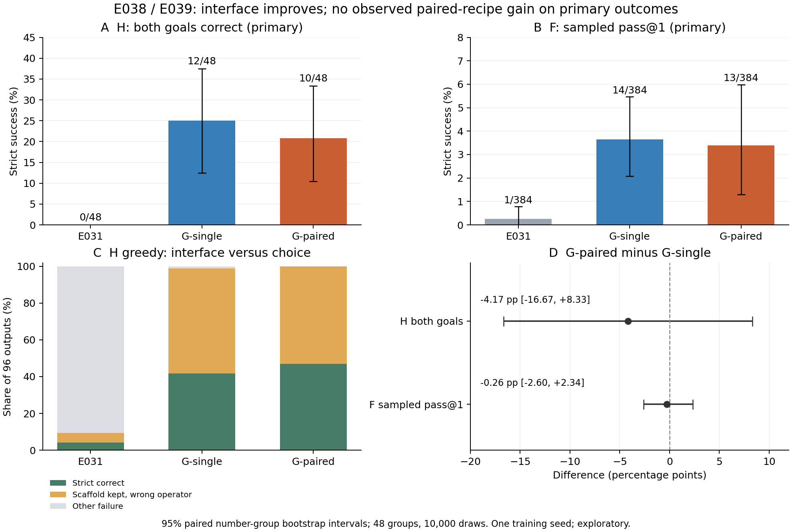

# E038/E039 completed: no observed advantage on either primary outcome

Both registered arms completed 256 updates from the same E031 adapter, with the
same F512 replay, H512 records, seed17, and fixed step256 endpoints. All 3,344
generations, 288 operator contexts / 1,152 candidate scores, and 4,096 reference
forwards completed once. Independent training, file, token, stop, request/RNG and
strict-score audits passed. The provider was confirmed off at 04:54:39 UTC on
September17 (21:54:39 September16, America/Los_Angeles); the timer was cleared.

| Primary outcome | G-single (E038) | G-paired (E039) | Paired minus single, 95% group interval |
|---|---:|---:|---:|
| H greedy, both goals strictly correct | 12/48 (25.00%) | 10/48 (20.83%) | −4.17 pp [−16.67, +8.33] |
| F sampled pass@1 | 14/384 (3.65%) | 13/384 (3.39%) | −0.26 pp [−2.60, +2.34] |

Family-cluster sensitivity over 36 observed skeleton families gives intervals
[−17.39, +10.00] pp and [−2.80, +2.62] pp. These are paired 10,000-draw bootstrap
intervals over this pool, not uncertainty over training seeds. Neither interval
establishes equality or excludes every useful effect. The point estimates provide
no reason to claim a paired-goal benefit. Four groups gain H double success while
six lose it. G-paired improves individual H targets (45/96 versus40/96), but that
does not improve reliable switching between both goals for the same group.

## What the shared training changed

E031 scores4/96 on H greedy and1/384 on F sampled. Both children improve those
counts substantially, but the intervention combines H interface training, F
replay and more optimization. There is no H-only or F-only ablation here. These
baseline-relative gains cannot be assigned specifically to paired supervision.

H greedy scaffold compliance rises from9/96 to95/96 and96/96. The remaining
failures are predominantly the wrong hole operator:55 and51, respectively.
Across each endpoint's480 main H outputs (greedy plus sampled), there are no
parse failures or unfilled-question-mark failures. G-single retains474/480
scaffolds and G-paired475/480; strict successes are189/480 and203/480. The
common interface problem was largely repaired, while conditional choice remains
unreliable. The sampled H fixed-index double-success statistic is33/192 versus
30/192; individual H sampled successes are149/384 versus158/384. Samples and
targets remain nested within48 independent number groups.

F remains difficult: both children score3/96 greedy. Pass@4 is13/96 versus10/96.
Among384 sampled F outputs, both children have359 stopped/parsed wrong-target or
wrong-resource outcomes, plus10/11 parse failures and one length cap each. The
detailed resource/target table further distinguishes simultaneous violations,
correct resources with a wrong target, and target hits with invalid resources.
Thus better output formatting does not establish free construction competence.
See FREE_CONSTRUCTION_TRANSFER.json and ERROR_CASES.md for exact denominators.

## Diagnostics do not overturn the primary result

Under a supplied legal prefix, unique-argmax operator correctness is24/96 for
E031,30/96 for G-single and31/96 for G-paired. Both-goal unique argmax is1/48,
4/48 and2/48. Ties count as failures. G-paired has14 tied contexts versus6 for
G-single. The two trained states prefer '+' uniquely only4 and5 times out of96,
despite24 '+' labels, and get only2/24 '+' labels right in this prefix protocol.
This differs from complete H generation and does not show inability to add.

G-paired improves the mean correct-versus-best-wrong log-probability margin by
0.4922 [0.2930,0.7070] nats, although both absolute means remain negative
(−1.0638 versus−0.5716). Conversely, D_goal decreases by0.1198
[−0.2005,−0.0391] nats. Candidate-normalized correct probability changes by only
0.0110 [−0.0091,+0.0315]. These mixed, unadjusted diagnostic contrasts should
not be selected to replace the prespecified behavioral outcomes.

On the frozen16 H-training groups, G-single gets11/16 trained anchors and6/16
unsupervised countergoals; G-paired gets8/16 and8/16, both supervised. This
small stratified diagnostic neither proves memorization nor establishes unseen
generalization. Its F view is transfer to the H-training numbers, not evaluation
of the actual F-replay training examples; F scores2/32 and1/32 cannot establish
failure to fit the F-replay pool.

Reference response NLL falls from0.4457 to0.0204 (single H),0.4460 to0.0248
(paired H), and0.7324 to0.0791/0.0796 on the shared F pool. Low whole-response
teacher-forced loss does not imply correct goal-critical operator generation.
The H references differ by treatment, and these NLLs are training diagnostics.
C greedy remains high at89/96,92/96,94/96. All13 failures were manually reviewed
and all288 scores independently replayed. The six trained-endpoint failures
contain locally true equations but alter the original expression through operand
order, input substitution or extra operations. Local arithmetic consistency is
not faithful program execution; see C_INTERFACE_ERROR_AUDIT.md.

## Research decision, proposed only

Keep this as a complete negative/inconclusive recipe result. It supports a
separation between interface acquisition, conditional choice and free program
construction, without identifying an internal mechanism. It does not support
claiming paired-goal transfer, structural OOD, superiority to same-goal paths,
or an interaction with the earlier preparation grid. E030 is not an ancestor.

The next useful step is a small, symmetric task-learning diagnostic: evaluate
the actual F replay pool and matched H training anchors/countergoals, including
the first goal-critical operator under teacher forcing versus free generation.
If insufficient supervised choice learning is confirmed, preregister a bounded
two-arm dose or target-token-loss intervention with unchanged data and separate
confirmation data. Do not automatically extend epochs, add G-breadth, sweep
seeds, switch models or run RL. Whole-response NLL alone is not the decision
criterion. The present48 groups are development evidence for subsequent design.

## Execution, preservation and cost

Execution source:801ef1279a2a817f754f856d9191725eebb1121a. Frozen release:
ca97959cac646eb709d428bede41e6aacc35ee7362b5fe01ddfa95e28d2e5536.
Total supervised tokens:265168 versus265228 (0.02263% difference); processed
nonpadding tokens:565064 versus565120. Both arms keep8H+8F per update. Measured
update time is533.156s versus534.908s; peak allocated GPU memory is10362369536B.
These are component measurements, not rental time or exact equal-FLOP claims.

One new bounded process receipt charged3018s; historical receipts remain intact,
bringing the combined count to27 and charged process time to17623s. The whole
powered window, conservatively03:29:00–04:54:39 UTC, is5139s (85m39s), with
an11.39145 CNY proxy at the verified7.98 CNY/hour rate, not an invoice. No paid
storage expansion or extra instance was used. Both older generation ledgers
(4784/4864 and2112/2304) are unchanged; this phase uses3344/3600.

40,473,429,556 bytes of historical duplicates were removed only after existing
independent backups and exact remote file sets/SHA were verified. New obsolete
rolling states were removed only after a newer state was independently backed.
Final free space is42,509,918,208B (39.59 GiB). E015 unique weights, E031, the
base model, runtime and historical compact records remain. All3422 inventoried
files (824,830,615B), plus the export manifest, are independently preserved.
Public compact data retains3409 exact files including that manifest; six binaries
and eight machine-path metadata files stay in the
private full backup, with original hashes in the inventory and identity records.

Initial Linux CPU validation detected a1ULP host cosine recomputation difference;
the pre-published repair accepts at most2ULP in validation while executing the
unchanged frozen LR vector.45 Linux checks then passed before model work. Slow
SSH backup and an HTTPS hidden-directory404 were transfer problems, resolved
without scientific reruns. See COST_AND_CLOSEOUT.json, the independent audit
reports, COMPACT_EXPORT_SCOPE.json and the storage receipts.

The phase is complete and paused for owner planning. No further model work is running.
