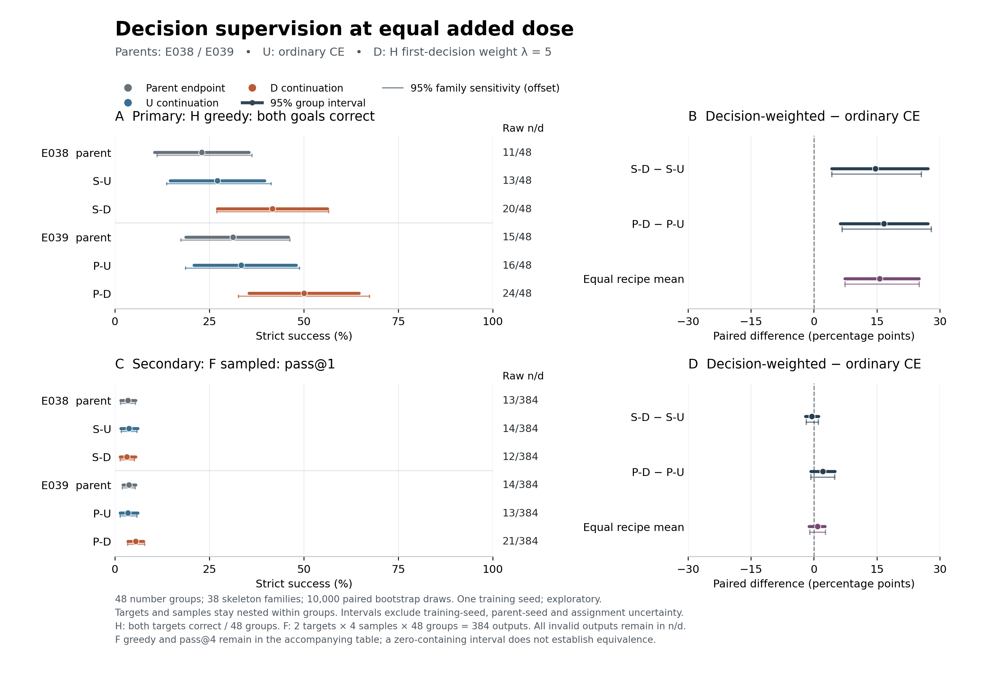

# E040–E043：首决策监督与等剂量续训，完整结果

日期：2026-09-17。**本轮全部完成，平台已确认关机，临时定时关机已清除。** 所有后续建议均未执行，等待 Zhice 调整研究方案。

本轮结果支持一个有限而明确的判断：在两个既有训练配方内部，相比相同追加剂量的普通 CE，首决策加权提高了新实例上的 H 双目标严格成功率。两配方的增量分别为 **+14.58 和 +16.67 个百分点**。这支持继续检验“监督重点限制局部补全表现”的假设；目前没有一致的自由构造迁移证据，也没有证明决策语义特异性、梯度稀释或通用推理提升。

## 1. 做了什么，哪些因素保持一致

H 给定有序程序骨架，要求补全未知操作；F 只给数字与目标，要求自由构造合法程序。S 为既有 single 配方，P 为既有 paired 配方；U 为普通 CE，D 为首决策加权。主要对比始终为同配方内 D−U。

| 角色 | 实验 | 父状态 | 本轮更新 | 正式端点 |
|---|---|---|---:|---|
| S-U | E040 | E038 step256 | 128 | step128 已保存 |
| S-D | E041 | 同一 E038 step256 | 128 | step128 已保存 |
| P-U | E042 | E039 step256 | 128 | step128 已保存 |
| P-D | E043 | 同一 E039 step256 | 128 | step128 已保存 |

四臂沿用 Qwen2.5-1.5B Base 与 LoRA r16/alpha32，每臂使用原 H512 与同一 F512，追加两个 epoch、每步 8H+8F，每条原训练记录恰好曝光两次。父 adapter 保留，optimizer/scheduler 在本阶段重置，训练 seed17；同配方内数据顺序、128 项 LR 数组、mask 与 RNG 设置一致。父状态的 256 步加本轮 128 步为该续训链段的 384 步，不能把本轮说成从基座独立训练 128 步。更早的 E031 祖先训练另有账目。

全部 1,024 条原 H 参考的首决策 span 均通过预先审计，本渲染器下每条 K=1。D 的 H token 权重为 `L × (5 if decision else 1) / (L + 4K)`，L 包括正常 EOS；F 权重为 1，prompt/padding 不参与监督。每条 H 的权重总质量仍为 L，**不保证梯度范数、方向或有效学习率相同**。没有加入 single 未监督反目标或其他新训练行。

step64 只作预定训练动态诊断；step128 是唯一正式新端点，没有根据结果挑检查点。运行前冻结源码 `2bb39fbdf5bf83bb471e436804e1b968262ff530`，release manifest SHA256 为 `ecd1e12dc792f36c9969354fde9764fce8811b2f39e39e0878238d6e2f7b5a5c`。

## 2. Stage A：真实训练题仍有明显行为缺口

F512 按原训练 prompt token 序列去重得到 256 道唯一问题。下表使用真实训练 prompt，接受任何合法正确的 F 表达式，不要求逐字复述参考。

| 父状态 | 真实 F 训练题 | H32 组共64目标 | H锚目标 | H反目标 | H双目标均对 |
|---|---:|---:|---:|---:|---:|
| E038 | 38/256（14.84%） | 36/64 | 23/32，已监督 | 13/32，未监督 | 7/32 |
| E039 | 35/256（13.67%） | 37/64 | 18/32，已监督 | 19/32，已监督 | 10/32 |

因此，低 F 成功率不能只解释成“训练题会做，但新题不会迁移”；真实 F 训练内自由生成也较弱。同时，E038 的 H 反目标未监督，不能将其失败归入已监督样本拟合失败。

原训练参考的非加权 NLL 分解如下。H512 与另行固定的 style0 H64 诊断参考不同，不能混合分母。

| 父状态与参考 | 整段 NLL | 首决策 NLL | 其余回答 NLL |
|---|---:|---:|---:|
| E038，实际 H512 | 0.020388 | 0.605515 | 0.011188 |
| E039，实际 H512 | 0.024811 | 0.884073 | 0.011306 |
| E038，实际 F512 | 0.079131 | 不适用 | 0.079131 |
| E039，实际 F512 | 0.079596 | 不适用 | 0.079596 |

这个实测分解说明，较低的整段 CE 能与更高的首决策损失同时存在；它没有直接测量梯度是否“被稀释”。F 的构造、输入复制及中间值分解保留在 `DECISION_DIAGNOSTICS.json`，没有因此改变 F 训练权重。

Stage A 的 640 条输出中，544 条存在第一次字面偏离，491 条有可认证的错误证据。这两个计数不等同：另一条合法 F 路径可以正确；严格最终违例或错误等式能证明错误，却不一定确定最早的真实推理错误。未获穷举完成性证书的 F 前缀不称为死路。H 中有 89 个实际发出的决策位置与参考前缀精确匹配，其他轨迹决策对齐仍为 unknown；逐题证据见 `PER_PROBLEM.jsonl` 与 `ERRORS.jsonl`。

89个可对齐的 H 决策中54个操作正确、35个错误；其余39条无法定位首操作。512条 F 的前缀死路判断全部保持 unknown。E038/E039各有17/14条成功 F 输出与参考字面不同，均被接受。F 局部等式一致分别为221/256与227/256，不一致27/256与25/256，无法判定8/256与4/256；局部算术一致仍可能选错数字或不达目标。H 局部等式一致为63/64与64/64。局部证据、严格成功与最早错误定位须分别理解，`ERRORS.jsonl`行数也不等于严格错误总数。

固定的 64 个 Stage A 对齐样本全部通过：保存了 82 组完整 raw/effective FP32 logits 向量，逐项核验 argmax 与精确 ties，核对 4,408 个实际 greedy 输出 token，没有发现同前缀下的真实实现不一致。该检查利用实际生成时的被动记录，没有追加生成或诊断前向；其覆盖限于固定样本，不能外推为所有模型行为的证明。

## 3. 新48组：主要行为结果

新池为预冻结的 48 个数字—骨架组，共 96 个目标，六种运算符对各8组，根部/内部空位各24组，实际涵盖38个骨架族。历史训练、校准、开发与诊断身份已排除，受保护集合只用身份哈希排除。它是本轮新实例探索集，不自动构成结构 OOD 或外部独立确认集。

| 状态 | H双目标 /48 | H单目标 /96 | F sampled正确 /384 | F greedy /96 | F pass@4 /96 |
|---|---:|---:|---:|---:|---:|
| E038 | 11 | 50 | 13 | 2 | 11 |
| E039 | 15 | 51 | 14 | 3 | 13 |
| S-U | 13 | 51 | 14 | 8 | 10 |
| S-D | 20 | 62 | 12 | 4 | 9 |
| P-U | 16 | 57 | 13 | 6 | 9 |
| P-D | 24 | 66 | 21 | 5 | 20 |

每个 F 目标采样4次，temperature0.7、top-p0.95、top-k0、最多512个新 token；H 只用 greedy。无效、解析失败与截断输出全部保留在分母。pass@4 的分母是96个目标，不是384次输出。

| 预定对比 | H双目标 D−U，百分点［95%组区间］ | 骨架族敏感性区间 | F sampled pass@1 D−U，百分点［95%组区间］ |
|---|---|---|---|
| S | +14.58［+4.17，+27.08］ | ［+4.17，+25.53］ | −0.52［−2.08，+1.04］ |
| P | +16.67［+6.25，+27.08］ | ［+6.67，+27.91］ | +2.08［−0.78，+4.95］ |
| 两配方等权均值 | +15.63［+7.29，+25.00］ | ［+7.29，+25.00］ | +0.78［−1.17，+2.60］ |

统计采用预定的10,000次、seed2026091714、六状态联合配对数字组 bootstrap；目标与采样始终嵌套于组。另一位审计者从逐题 strict 布尔值重新构造矩阵并复算，主/次六个对比的组与骨架族区间一致。**只有一个训练 seed，两配方不是两个独立 seed**；区间不包括训练、父状态或数据分配不确定性，没有多重比较校正，跨零不表示等价。

H 在两配方中的 D−U 方向一致，组和骨架族区间均为正。F sampled 的三个预定对比均跨零，F greedy 两配方 D 均低于 U，不能报告一致的自由构造增益。P 的探索性 pass@4 有 9→20/96 的改善，差值 +11.46 pp［+3.13，+19.79］；S 则为10→9/96。这个辅助信号应保留，但不能取代预定的 F sampled pass@1 结论。

旧池 E038/E039 的 H 双目标12/48 对10/48、paired−single −4.17 pp且区间跨零的结果不变。本轮父状态11/48对15/48来自另一批新题，不是对旧结论的更正。父状态与续训终点的比较还混入额外优化；本轮归因依赖同父状态、同追加剂量的 D−U。

## 4. 如何理解收益与限制

**收益主要集中在根部空位。** S 的根部双目标成功12→17/24、内部1→3/24；P 的根部14→21/24、内部2→3/24。两种 D 终点的内部空位均只有3/24。完整六个运算符对及目标角色分层见 `SECONDARY_STRATA.md`；小分层只作描述，没有另算显著性或选择有利子组。新池的 anchor/countergoal 是预冻结分配角色，不能称新题的“见过/没见过目标”。

**条件参考损失与自主行为不总同向。** 新 H 上，S-U→S-D 的首决策非加权 NLL 为1.4956→1.6919，反而上升；P-U→P-D 为0.9658→0.7859，下降。因此不能说“两种配方都通过降低新题首决策 NLL 改善行为”。条件候选排名、margin 与 D_goal 在参考前缀下测量，不能替代自由构造，也不能据此宣称内部 goal-binding 机制已识别。

| 状态 | 首决策 NLL | 正确唯一 argmax /96 | 双目标唯一 argmax /48 | D_goal | 平均正确−最强错误 logp margin | 四候选原始概率质量 | top tie /96 |
|---|---:|---:|---:|---:|---:|---:|---:|
| E038 | 1.2117 | 50 | 11 | 2.5859 | 0.16536 | 0.99965838 | 6 |
| E039 | 1.0151 | 50 | 13 | 2.3854 | 0.28255 | 0.99982369 | 10 |
| S-U | 1.4956 | 54 | 13 | 5.6875 | 0.83073 | 0.99976309 | 3 |
| S-D | 1.6919 | 60 | 18 | 9.6641 | 1.85677 | 0.99976313 | 1 |
| P-U | 0.9658 | 57 | 18 | 5.1172 | 0.98307 | 0.99995316 | 4 |
| P-D | 0.7859 | 61 | 22 | 7.8411 | 2.03255 | 0.99992365 | 7 |

D_goal表示同组目标切换时，两目标对应运算符的原始 log-probability 偏好差的变化，不是成功率。D−U 为 S +3.9766［2.7969，5.2630］、P +2.7240［1.9505，3.5260］；这些探索性组区间没有多重比较校正。候选原始概率质量与候选内归一化概率分开保存，tie不计为唯一 argmax。P 的ties反而4→7，不能笼统报告“加权减少ties”。这些条件指标与自主H的62/96、66/96有不同定义。

新池所有 H 输出均以 native EOS 结束。“遵守骨架但空位操作错误”从 S-U的43/96降到S-D的31/96、P-U的37/96降到P-D的25/96；其他结构/数字违规却为2→3、2→5。P-D同时满足数值目标与数字资源为67/96，严格 H为66/96，说明骨架约束仍不能忽略。

**训练目标之间可能存在取舍。** 固定 F64 训练诊断终点 S-U/S-D 为21/64与16/64，P-U/P-D为23/64与11/64；D 的同一 F 参考 NLL 也较 U 差。这是需要后续控制实验解释的现象，尚不能诊断为已证实的遗忘机制。固定中期/端点训练诊断与新实例结果分别保存，未用来选择 checkpoint。

具体而言，F512参考的整段NLL在S为U 0.04838、D 0.05818，在P为U 0.04978、D 0.05985；四者相对各自父状态仍较低。H32训练诊断中，S锚目标30→32/32、未监督反目标13→13/32；P锚目标18→22/32、反目标25→25/32。

本轮提高了问题的可辨识程度：局部 H 行为可以被监督重点干预改善，但更难的内部空位与 F 自由构造仍未解决。首决策位置的语义作用、普通位置再加权的优化作用，以及参考前缀与自主轨迹差异，仍是竞争解释。

## 5. 下一步建议：仅供决定，尚未执行

优先新增一个**位置/数量匹配的非决策 token 加权对照**。沿用相同父状态、原训练数据、128步剂量、lambda5和标量质量归一化，按不依赖模型成绩的规则，在可匹配位置选择非决策 token；记录无法匹配的行，不能为匹配偷偷修改模板或训练支持。保留普通 CE、首决策加权及两种配方，预先冻结新的评估身份和主要对比。这一步检验决策语义特异性，避免直接把本轮收益归结为关键决策监督。

若对照仍支持首决策特异收益，再单独制定独立训练 seed、较早共同父起点及独立题族的复验预算。需要覆盖父状态随机性时，应重新训练相应父链，不能只在同一继承父状态上改变续训 seed。题目数量、seed数量和成本需在新计划中确定；本轮没有自动启动它们。

F 路线暂不靠继续追加 epoch 或搜索 lambda 推进。后续可利用已保存逐题轨迹，先缩小真实训练 F 的可认证首错误与 unknown 范围，再讨论单项、受控的前缀恢复或表示干预。当前证据不足以把 H 正结果写成自由程序搜索、结构泛化、通用推理提升或方法新颖性。

## 6. 完整性、资源与关机

| 账目 | 本轮实测 |
|---|---:|
| 四臂 committed 更新 | 512/512；无中断剂量或未提交更新 |
| 生成视图与唯一输出 | 38/38；4,736/4,736 |
| 收费生成预约 / 上限 | 4,736/5,000；无故障重试消耗 |
| 诊断视图 | 28/28 |
| 参考分解记录 | 6,848 |
| 候选上下文 / 分数 | 704 / 2,816 |
| 前向序列等价请求 / 上限 | 7,552/16,384；无已收费未保存余账 |
| 诊断前向输入 token | 1,047,526 |
| 本轮 process receipt | 1份；wall 4,784.052832秒，计账4,785秒 |
| 历史累计 process receipts | 28份 / 22,408秒 |

四臂每条原训练记录恰好两次曝光；恢复状态中每臂392份 AdamW 参数状态均为step128，四个 RNG 域在四臂终态一致。独立 CPU 审计核对8份科学 adapter及4份最终 optimizer/RNG恢复状态；这不是 GPU 上完整重放训练或恢复测试。冻结源代码的38项针对性测试在本地及 Linux 均通过，实际执行的164份源码 SHA 与已发布版本一致。

旧生成账本4,784/4,864、2,112/2,304、3,344/3,600保持不变。原 launcher 两个元数据标签有误：`planned_candidate_scores=2304`漏计 Stage A 的512个分数，正确计划和实际均为2,816；`planned_forward_contexts=16384`写入的是预算上限，正确计划和实际均为7,552。实际冻结队列、执行及预算没有超范围；原文件保持原样，另附 `FORWARD_METADATA_ERRATUM.md/.json`。

完整私有备份含清单内 **19,265文件 / 2,073,289,337字节**，另有导出 manifest自身；每个文件独立 SHA校验通过。导出 manifest SHA256：`dfe6ea11c88cd8f32287968dc76dde6ede4bf6089ed3d3bb058d12684f859ea7`。公开 compact 原样保留所有科学 JSON、输出 token与完整 logits，共19,238文件 /596,875,068字节；28个权重/恢复二进制及含本机路径的 PEFT元数据留在私有备份，未改写原始证据。旧 E015 独立完整权重备份待办仍未解决，相关唯一文件未删除。

根据已核验备份 ACK，删除30个过期滚动恢复文件，释放 **6,218,016,984字节（6.22 GB）**。这是有明确删除回执的范围，未把历史清理重复计入。最后磁盘检查时间07:55:03 UTC，可用40,179,568,640字节（约37.42 GiB）。

保守开机代理起点为 **2026-09-17 05:56:00 UTC**，平台在 **07:58:23 UTC** 已确认关机，07:59:00 UTC确认临时定时器清除，保留实例存储。整个开机代理窗口约 **2小时2分23秒**；现场核验费率¥7.98/小时，估算 **¥16.28**，未超过4小时/¥40封顶。**这是开机时长代理估算，未核对实际账单。** 进程时间、诊断前向时间与开机窗口分别记账，不能相互替代。

## 7. 交付与复查入口

- `RESULTS.md`、`SUMMARY.json`、`BEHAVIOR_RESULTS.json`：完整六状态行为与预定统计。
- `STAGE_A_TRAIN_FIT.md`、`DECISION_DIAGNOSTICS.json`、`TRAINING_DIAGNOSTICS.json`：训练拟合、参考损失与动态。
- `PER_PROBLEM.jsonl`、`ERRORS.jsonl`：逐题评分、错误证据与 unknown。
- `SECONDARY_STRATA.md/.json`、结果图及 provenance：描述性分层与图源。
- `COST_SHUTDOWN.json`（与`COST_AND_CLOSEOUT.json`同内容）、`PHASE_LEDGER.json`、独立审计：费用、备份和关机证据。
- `experiments/post_e039_decision_supervision/release_v1/` 内的 `DECISION_SPAN_AUDIT.jsonl`、`CONTINUATION_MANIFEST.json`，以及实验根目录的 `WEIGHTED_LOSS_CONTRACT.json`：冻结干预与训练协议。
- `REPRODUCTION.md`、`analysis_code/`、`DELIVERY_MANIFEST.json`：复查命令与补充材料校验清单；原 core `manifest.json`保持不变。
- `SEWON_BRIEF.md`：供 Zhice 审阅、自行发送的一页讨论草稿，未向任何人发送。

结果 ZIP：`CS294_Post_E039_Decision_Supervision_Results_2026-09-17.zip`。其中原始规划与实际结果分开，逐成员校验 SHA、大小与CRC；不包含模型权重、恢复二进制、凭据或受保护题目正文。完整权重与恢复状态保存在独立私有备份中。
